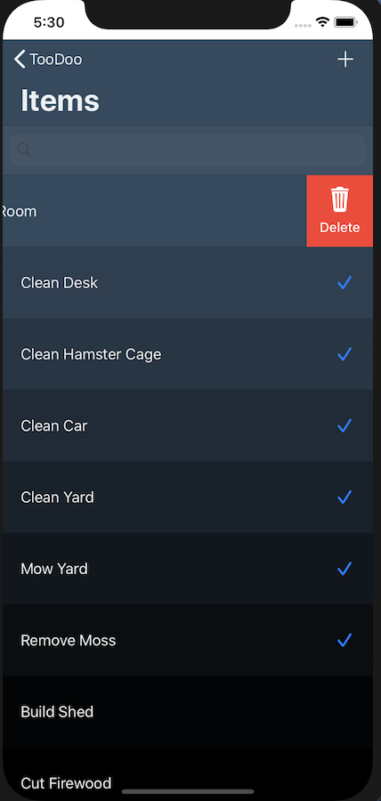

# TooDoo
> Another ToDo List App

[![Swift Version][swift-image]][swift-url]
[![License][license-image]][license-url]

A simple ToDo Item app that allows a user to check off done items or delete them. 

## Features
1. Realm Database
2. Chameleon UI 
3. SwipeCellKit

## Requirements 
- iOS 13.6+
- Xcode 9.3+

## Installation
1. Clone the `TooDoo` project 
2. Run `Pod-Install` in Terminal
3. Open workspace file

[swift-image]:https://img.shields.io/badge/swift-5.0-orange.svg
[swift-url]: https://swift.org/
[license-image]: https://img.shields.io/badge/License-MIT-blue.svg
[license-url]: https://opensource.org/licenses/MIT
